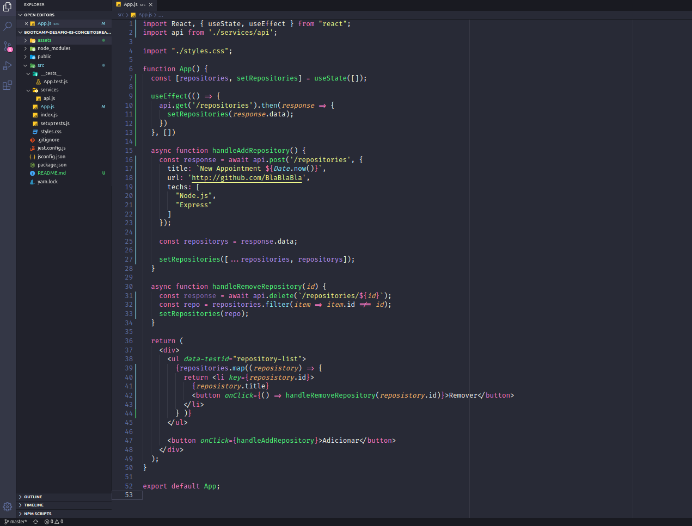
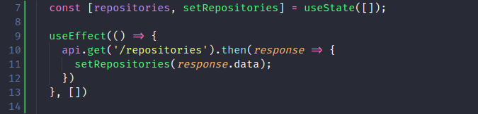
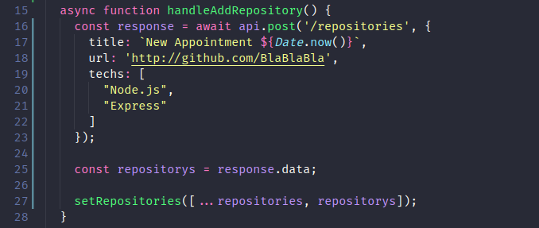
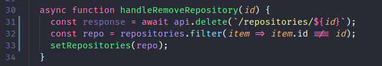
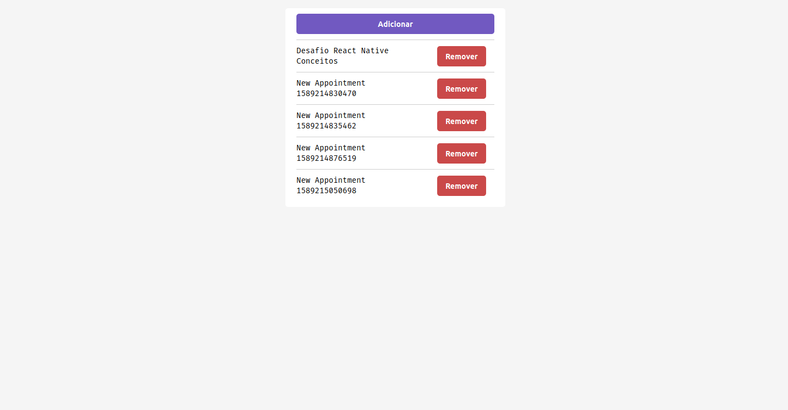

<h1>Bootcamp Desafio 03 - Conceitos ReactJS</h1>
Nesse desafio, fora criada uma aplicação básica para treinar o que foi aprendido até agora no ReactJS!

Dada aplicação tem como objetivo, ser a parte visual da aplicação backend, disponibilizando na tela: listagem de repositórios, cadastro(primeiramente básico ao clique de adicionar) e exclussão de repositórios.

Para o desafio, foi usado o **[Template](https://github.com/Rocketseat/gostack-template-conceitos-reactjs).**
 

## Funcionalidades da aplicação

Abaixo se encontra o código do `App.js`, componente com as funções necessárias para listar, adicionar e excluir repositórios:

<p align="left">
  
</p>

- **`Listar os repositórios da API`**: Criar uma lista com o campo title de todos os repositórios que estão cadastrados na API.
<p align="left">
  
</p>

No código acima o `useEffect` tem o objetivo de receber os repositórios inicialmente, e os adicionar ao array. Posteriormente, este array é listado nos `<li>` da aplicação.

```
<ul data-testid="repository-list">
  {repositories.map((reposistory) => {
    return <li key={reposistory.id}>
      {reposistory.title}
      <button onClick={() => handleRemoveRepository(reposistory.id)}>Remover</button>
    </li>
    } )}
</ul>
```

- **`Adicionar um repositório à API`**: Adicionar novo item à API através do clique de um botão.
<p align="left">
  
</p>

Temos aqui o envio de um objeto para a rota `/repositories` cada vez que esta função é chamada. Após isso, o item adicionado é atualizado no array de repositorios da aplicação em `setRepositories([...repositories, repositorys]);`

- **`Remover um repositório da API`**: Remover um item da API através do clique de um botão.
<p align="left">
  
</p>

Apartir da id passada para a função, a mesma manda uma requisição para a rota delete, com a especifica id. Em seguida, cria um novo array sem o elemento deletado, posteriormente o atualizando no `setRepositories`.

## Tela Aplicação

Abaixo se encontra a tela desta aplicação, deixando evidentes as principais funções.

<p align="left">
  
</p>

## Para Mais Detalhes

Para mais detalhes a respeio do desafio, checar página oficial do mesmo em **[Desafio](https://github.com/Rocketseat/bootcamp-gostack-desafios/tree/master/desafio-conceitos-reactjs)**.